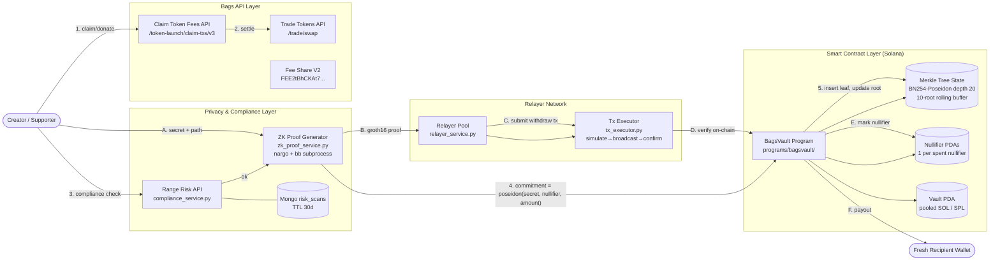

# Arsitektur Sistem BagsVault: Protokol Privasi Kreator Terdesentralisasi

**BagsVault** adalah protokol privasi yang dirancang khusus untuk ekosistem kreator di Bags.fm. Sistem ini memungkinkan kreator dan pengguna untuk menerima fee, melakukan donasi, dan memindahkan token secara anonim menggunakan *Zero-Knowledge Proofs* (ZK-SNARKs), sambil tetap mematuhi regulasi melalui integrasi verifikasi risiko on-chain.

> Diagram arsitektur (Mermaid — render otomatis di GitHub). Sumber lengkap di
> [`docs/bagsvault_architecture.mmd`](./bagsvault_architecture.mmd); versi
> ASCII untuk terminal viewer di [`docs/bagsvault_architecture.txt`](./bagsvault_architecture.txt).

## 0. Status Implementasi Repo (Ringkasan)

Tabel di bawah memetakan setiap pilar arsitektur ke lokasi sumbernya di repo ini.

| Pilar | Lokasi | Status |
|---|---|---|
| BagsVault Anchor program | [`programs/bagsvault/`](../programs/bagsvault/) | ✅ Implementasi penuh (Merkle, nullifier, Groth16) + suite uji integrasi Rust di `programs/bagsvault/tests/` |
| Rust integration tests | [`programs/bagsvault/tests/`](../programs/bagsvault/tests/) | ✅ `cargo test -p bagsvault` — initialize/deposit/withdraw/pause + double-spend smoke |
| Sunspot CPI fallback | [`programs/bagsvault/src/sunspot.rs`](../programs/bagsvault/src/sunspot.rs) | 🟡 Stub — operator opt-in via `verifier_program` account; layout perlu konfirmasi sebelum mainnet |
| Sirkuit Noir ZK | [`circuits/bagsvault_withdraw/`](../circuits/bagsvault_withdraw/) | ✅ Implementasi (perlu `nargo compile` + ceremony) |
| IDL Anchor | [`idl/bagsvault.json`](../idl/bagsvault.json) | ✅ Dibundel — di-load oleh backend `AnchorDecoder` |
| Backend ZK proof generator | [`backend/app/services/zk_proof_service.py`](../backend/app/services/zk_proof_service.py) | ✅ Orkestrasi nargo + bb (subprocess) |
| Endpoint proof generator | [`backend/app/routers/proofs.py`](../backend/app/routers/proofs.py) | ✅ `POST /api/proofs/commitment` + `/withdraw` |
| Bags API integration | [`backend/app/clients/bags_api.py`](../backend/app/clients/bags_api.py) | ✅ Trade, claim-fees, fee-share |
| Range Risk integration | [`backend/app/clients/range_risk.py`](../backend/app/clients/range_risk.py) | ✅ Pre-deposit gating + cache TTL 30 hari |
| Relayer network + tx executor | [`backend/app/services/relayer_service.py`](../backend/app/services/relayer_service.py), [`backend/app/clients/tx_executor.py`](../backend/app/clients/tx_executor.py) | ✅ Sign → simulate → broadcast → confirm |
| Indexer + WS push | [`backend/app/services/merkle_indexer.py`](../backend/app/services/merkle_indexer.py), [`backend/app/services/indexer_worker.py`](../backend/app/services/indexer_worker.py) | ✅ Polling + opsional WebSocket subscribe |

Catatan operasi: setelah `anchor deploy` menerbitkan program ID baru, ganti `BAGSVAULT_PROGRAM_ID` di `backend/.env`. Sebelum bukti penarikan dapat diverifikasi on-chain, jalankan trusted setup (lihat [`circuits/bagsvault_withdraw/README.md`](../circuits/bagsvault_withdraw/README.md)) dan substitusikan VK ke `programs/bagsvault/src/verifier.rs`.

## 1. Ringkasan Protokol

Ekosistem kreator sering kali menghadapi masalah transparansi radikal di blockchain publik. Ketika dompet seorang kreator diketahui, seluruh riwayat transaksi, donasi, dan pendapatan *fee* mereka terekspos ke publik. BagsVault memecahkan masalah ini dengan mengimplementasikan arsitektur *mixer/tumbler* menggunakan sirkuit Noir ZK dan verifikasi Groth16 on-chain di Solana.

Protokol ini beroperasi melalui dua fase utama yang memutus hubungan on-chain antara pengirim (deposit) dan penerima (withdrawal), menciptakan *anonymity set* yang kuat [1].

## 2. Arsitektur Komponen Utama

Sistem BagsVault terdiri dari empat pilar utama yang saling terintegrasi:

### A. Lapisan Smart Contract (Solana On-Chain) — `programs/bagsvault/`
Lapisan ini menangani logika inti dari privasi dan penyimpanan dana. Implementasi Anchor (BPF) tersedia di [`programs/bagsvault/src/lib.rs`](../programs/bagsvault/src/lib.rs).

| Komponen | Fungsi | Lokasi sumber |
|----------|--------|----------------------|
| **BagsVault Program** | Instruksi `initialize`, `deposit_sol`/`deposit_spl` (alias `deposit` → SOL), `withdraw_sol`/`withdraw_spl` (alias `withdraw` → SOL), `register_fee_share`, `pause`, `unpause`, `rotate_authority`. SOL pool memakai system-program transfer, SPL pool memakai `anchor_spl::token::transfer` dengan vault PDA sebagai authority. | [`src/lib.rs`](../programs/bagsvault/src/lib.rs) + [`src/instructions/`](../programs/bagsvault/src/instructions/) |
| **Merkle Tree State** | Incremental BN254-Poseidon tree depth 20, **rolling buffer 10 root terakhir** sesuai dokumen. PDA `[b"merkle_tree", token_mint]`. | [`src/state.rs::MerkleTreeState`](../programs/bagsvault/src/state.rs), [`src/merkle.rs`](../programs/bagsvault/src/merkle.rs) |
| **Nullifier Set** | Satu PDA per nullifier (`[b"nullifier", &hash]`); double-spend dilindungi oleh constraint Anchor `init` yang gagal jika PDA sudah ada. | [`src/state.rs::Nullifier`](../programs/bagsvault/src/state.rs) |
| **Groth16 Verifier** | Verifikasi in-program memakai crate [`groth16-solana`](https://github.com/Lightprotocol/groth16-solana) (BN254). VK didefinisikan di [`src/verifier.rs`](../programs/bagsvault/src/verifier.rs); ganti placeholder dengan output ceremony. Fallback CPI ke Sunspot tetap dimungkinkan via `BAGSVAULT_VERIFIER_ID`. | [`src/verifier.rs`](../programs/bagsvault/src/verifier.rs), [`src/instructions/withdraw.rs`](../programs/bagsvault/src/instructions/withdraw.rs) |

### B. Integrasi Bags API Layer
Protokol ini secara mendalam memanfaatkan infrastruktur Bags API untuk manajemen token dan pendapatan.

*   **Trade Tokens API (`/trade/swap`)**: Digunakan untuk melakukan *swap* token secara otomatis sebelum deposit jika pengguna ingin mendepositkan token kreator spesifik [3]. Orkestrator chained tersedia di [`backend/app/services/swap_to_deposit_service.py`](../backend/app/services/swap_to_deposit_service.py); endpoint `POST /api/bags/swap-to-deposit` mengembalikan pasangan `(swap_tx, deposit_tx)` base64 yang harus ditandatangani dompet pengguna secara berurutan — backend tidak pernah memegang kunci.
*   **Claim Token Fees API (`/token-launch/claim-txs/v3`)**: Kreator dapat mengklaim *fee* mereka langsung ke dalam BagsVault secara anonim [4]. Orkestrator chained tersedia di [`backend/app/services/claim_to_deposit_service.py`](../backend/app/services/claim_to_deposit_service.py); endpoint `POST /api/bags/claim-to-deposit` mengembalikan batch claim tx + deposit tx untuk ditandatangani berurutan.
*   **Fee Share Configuration (`FEE2tBhCKAt7shrod19QttSVREUYPiyMzoku1mL1gqVK`)**: Berinteraksi dengan program *Fee Share V2* Bags untuk memastikan distribusi pendapatan yang tepat [5]. On-chain entry point-nya adalah instruksi `register_fee_share(bps)` di [`programs/bagsvault/src/instructions/fee_share.rs`](../programs/bagsvault/src/instructions/fee_share.rs) — instruksi ini melakukan CPI ke Fee Share V2 dengan vault PDA sebagai *recipient*. Catatan: layout instruksi Fee Share V2 belum terverifikasi terhadap program on-chain (placeholder discriminator); cari komentar `TODO(fee-share)` di [`src/fee_share.rs`](../programs/bagsvault/src/fee_share.rs) sebelum deploy ke mainnet.

### C. Lapisan Privasi & Kepatuhan (Backend)
Lapisan ini menyeimbangkan antara privasi absolut dan kepatuhan terhadap regulasi (AML/CTF).

*   **ZK Proof Generator**: [`backend/app/services/zk_proof_service.py`](../backend/app/services/zk_proof_service.py) mengorkestrasi `nargo execute` + `bb prove` di subprocess sandbox per request. `PoseidonHasher` membungkus backend Poseidon (mendukung `poseidon_hash` / `poseidon-py`, dengan fallback yang **disengaja salah** sehingga proof yang dihasilkan tanpa toolchain ditolak on-chain). Endpoint klien: `POST /api/proofs/commitment` (deposit-side), `POST /api/proofs/withdraw` (withdrawal-side) — lihat [`backend/app/routers/proofs.py`](../backend/app/routers/proofs.py).
*   **Range Risk API Integration**: [`backend/app/clients/range_risk.py`](../backend/app/clients/range_risk.py) + [`backend/app/services/compliance_service.py`](../backend/app/services/compliance_service.py). Hasil scan disimpan di Mongo `risk_scans` dengan TTL 30 hari sehingga keputusan gating tidak menambah biaya inference per deposit. Pendekatan ini terinspirasi dari arsitektur pemenang Solana Privacy Hack [6].

### D. Relayer Network
Jaringan relayer memungkinkan pengguna untuk melakukan penarikan dana tanpa harus memiliki SOL di dompet tujuan baru mereka (*gasless transactions*). Relayer akan membayarkan biaya gas Solana dan mengambil sebagian kecil dari dana penarikan sebagai kompensasi.

Mulai Phase 4, *cut* relayer dipotong **on-chain** oleh handler `withdraw` di [`programs/bagsvault/src/instructions/withdraw.rs`](../programs/bagsvault/src/instructions/withdraw.rs):

*   Pool menyimpan `relayer_fee_bps: u16` di [`MerkleTreeState`](../programs/bagsvault/src/state.rs) (di-set oleh `initialize`, dibatasi maksimum 1000 bps = 10%).
*   `relayer_cut = amount * relayer_fee_bps / 10000`; sisanya ke `recipient`. Transfer keduanya menggunakan pola `try_borrow_mut_lamports` PDA-owned native account.
*   Nilai `fee_bps` di-bind ke proof melalui public input **index 5**, sehingga relayer jahat tidak bisa me-replay proof terhadap pool dengan *cut* yang berbeda. Tiga lapisan harus sepakat pada nilai ini: sirkuit Noir, verifier on-chain, dan prover off-chain (`backend/app/services/zk_proof_service.py`).

## 3. Alur Transaksi Lengkap

### Fase 1: Deposit (Pengumpulan Dana)
Fase ini terjadi ketika kreator mengklaim *fee* atau pendukung melakukan donasi.

1.  **Pemeriksaan Kepatuhan**: Dompet pengirim diperiksa menggunakan Range Risk API. Jika terdeteksi sebagai entitas berisiko tinggi, deposit ditolak.
2.  **Pembuatan Komitmen**: Klien pengguna menghasilkan rahasia (*secret*) dan *nullifier* secara lokal. Klien kemudian menghitung *commitment* = `hash(nullifier, secret, amount)`.
3.  **Eksekusi Deposit**: Pengguna mengirimkan token beserta *commitment* ke smart contract BagsVault.
4.  **Pembaruan State**: Smart contract menambahkan *commitment* ke dalam Merkle Tree dan memperbarui *root* on-chain.

### Fase 2: Withdrawal (Penarikan Anonim)
Fase ini terjadi ketika kreator ingin mencairkan dana ke dompet baru (fresh wallet) tanpa jejak.

1.  **Pembuatan ZK Proof**: Klien memberikan *secret*, *nullifier*, dan *Merkle path* ke ZK Proof Generator. Generator membuat bukti matematis bahwa *commitment* ada di dalam Merkle Tree.
2.  **Permintaan Relayer**: Pengguna mengirimkan ZK Proof, *nullifier hash*, dan alamat tujuan ke Relayer.
3.  **Verifikasi On-Chain**: Relayer mengirimkan transaksi ke smart contract. Contract menggunakan CPI ke program Sunspot untuk memverifikasi ZK Proof [2].
4.  **Pencegahan Double-Spend**: Contract memeriksa apakah *nullifier hash* sudah pernah digunakan. Jika belum, *nullifier* dicatat.
5.  **Pencairan Dana**: Token dikirim ke alamat tujuan baru yang sepenuhnya bersih dari riwayat transaksi sebelumnya.

## 4. Spesifikasi Teknis & Kriptografi

Sirkuit Zero-Knowledge ditulis menggunakan bahasa **Noir** dan dapat ditemukan di [`circuits/bagsvault_withdraw/src/main.nr`](../circuits/bagsvault_withdraw/src/main.nr). Build pipeline: `nargo compile` → `bb prove` → bytes 256-byte yang langsung dikonsumsi `programs/bagsvault/src/verifier.rs::verify_withdraw_proof`.

**Public Inputs (urutan harus match `verifier.rs::NUM_PUBLIC_INPUTS = 6`):**
1.  `root` — Merkle tree root saat ini (bytes32 BE).
2.  `nullifier_hash` — `poseidon(nullifier, leaf_index)`.
3.  `recipient` — Alamat penarikan tujuan (32 byte pubkey).
4.  `amount` — Jumlah penarikan (binding ke denominasi pool tetap).
5.  `relayer` — Pubkey relayer; mengikat proof ke pengirim sehingga tx tidak bisa di-frontrun di mempool.
6.  `fee_bps` — *Cut* relayer (basis points) yang diiklankan pool, di-encode sebagai `u64_to_field`. Mengikat proof ke konfigurasi pool sehingga relayer tidak bisa memotong nilai berbeda dari yang dibuktikan.

**Private Inputs (witness):**
*   `nullifier`, `secret`: Preimage komitmen (`commitment = poseidon(nullifier, secret, amount)`).
*   `leaf_index`: Posisi commitment dalam tree (0..2²⁰).
*   `merkle_path`: 20 sibling hash dari leaf ke root.
*   `is_left`: 20 bit indikator posisi node pada setiap level.

Integritas hash dijaga oleh kesepakatan tiga sisi: sirkuit Noir, kalkulasi off-chain di Python (`PoseidonHasher`), dan insertion on-chain (`merkle::insert` di [`programs/bagsvault/src/merkle.rs`](../programs/bagsvault/src/merkle.rs)) — semuanya menggunakan parameter Poseidon BN254 yang sama.

## 5. Keunggulan Kompetitif untuk Hackathon Bags

1.  **Blue-Ocean Track**: Mayoritas peserta hackathon Bags fokus pada "AI Agents". Memasuki *track* Privacy dengan arsitektur ZK-SNARK yang solid memberikan peluang kemenangan yang jauh lebih tinggi.
2.  **Kesesuaian Narasi**: Bags adalah platform untuk kreator. Privasi finansial adalah masalah nyata bagi kreator besar yang tidak ingin seluruh pendapatannya dilacak oleh publik.
3.  **Compliance-Ready**: Mengintegrasikan Range Risk API menunjukkan kedewasaan teknis. Protokol privasi murni sering ditolak oleh institusi, tetapi protokol privasi dengan kepatuhan pra-deposit adalah masa depan DeFi [6].
4.  **Pemanfaatan Ekosistem Maksimal**: Arsitektur ini tidak hanya berjalan di Solana, tetapi secara khusus menggunakan Bags API untuk *trading* dan klaim *fee*, menunjukkan pemahaman mendalam tentang infrastruktur penyelenggara.

---

### Referensi
[1] Solana Mixer GitHub Repository. "Solana Mixer enhances privacy on the Solana blockchain." https://github.com/albertoslavicadev/solana-mixer
[2] Noir Solana Private Transfers. "Privacy-preserving SOL transfers using Noir ZK circuits and onchain Groth16 verification via Sunspot." https://github.com/catmcgee/noir-solana-private-transfers
[3] Bags API Documentation. "Trade Tokens." https://docs.bags.fm/how-to-guides/trade-tokens
[4] Bags API Documentation. "Claim Token Fees." https://docs.bags.fm/how-to-guides/claim-fees#claim-token-fees
[5] Bags API Documentation. "Program IDs." https://docs.bags.fm/principles/program-ids
[6] Range Security Blog. "Privacy meets compliance: The winners of our Solana Privacy Hack bounty." https://www.range.org/blog/privacy-meets-compliance-the-winners-of-our-solana-privacy-hack-bounty
